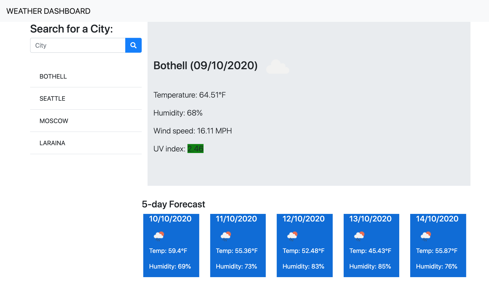

# weather_city_btns
Weather dashboard

The site shows current weather and forecast in the chosen city.

### How  it look?

### Where it deployed?

[Weather Dashboard](https://myau5x.github.io/weather_city_btns/)

### How it work?

User search for city. 

Then website send API request to openweathermap.org and grab weather and location for that city, and sent another request to find forecast for that location.

Temperature, humidity, wind speed, weahter icon and UV index are shown for current weather.

UV index is shown in different color depends on value (less than 3 &ndash green, 3-5 &ndash yellow, 6-7 &ndash orange, greater than 8 &ndash red)

Temperature, humidity and weather icon are shown for 5-day forecast.

All search city are added in history (browser local storage).

If user clicked on city in search history then he will see weather and forecast for that city.

If user comes to website again then he will see weather for last searched city and search history.

### Files
- `index.html` &ndash; html page
- `ctyle.css` &ndash; styles for html
- `script.js` &ndash; script that works with weather dashboard

### What did I use?

I used openweathermap.org API to show current weather and forecast.
I used Jquery to make dinamic html.
I used Bootstrap and FontAwesome to design my page.

### Licence
[MIT License](https://github.com/Myau5x/one_day_planner/blob/master/LICENSE)
